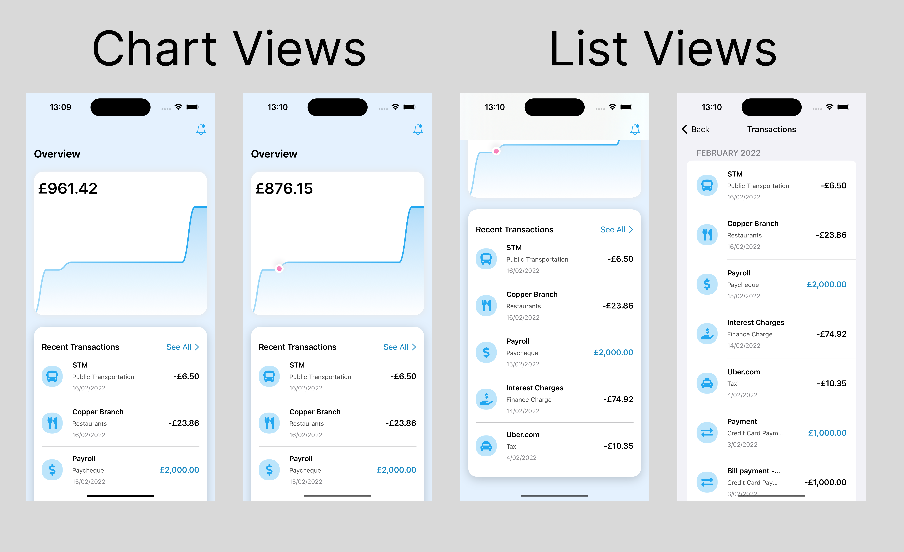

# ExpenseTracker App

**ExpenseTracker** is a simple and intuitive expense tracking app designed to help you manage your finances with ease. The app provides clear visuals of your income and spending, offering both a transaction list and an interactive chart to keep you informed about your financial activities.

## Features

- **Visual Chart**: See your income and spending transactions clearly with a line chart, giving you an easy way to track your financial history at a glance.
- **Transaction List**: View all your transactions, neatly categorized by date. Each month is separated with a title, making it easy to review your financial activity.
- **Dark and Light Modes**: Experience a seamless switch between light and dark modes for comfortable viewing, no matter the time of day.

## Screenshoot

  
## Dependencies

This project makes use of the following dependencies:

- [**Swift Collections**](https://github.com/apple/swift-collections) – used for efficient data structures like `OrderedDictionary`.
- [**SwiftUICharts**](https://github.com/AppPear/ChartView) – used to display clean and informative charts.
- [**SwiftUIFontIcon**](https://github.com/huybuidac/SwiftUIFontIcon) – used for displaying custom icons in the transaction rows.

## Acknowledgements

Special thanks to [**Design+Code**](https://designcode.io/) for the design inspiration and guidance used in building this app.

## Getting Started

1. Clone the repository:
   ```bash
   git clone https://github.com/OzgunEfe/ExpenseTracker.git
   ```

2. Install the dependencies:
   - You can integrate the required dependencies via Swift Package Manager (SPM).

3. Build and run the app on iOS using Xcode.
